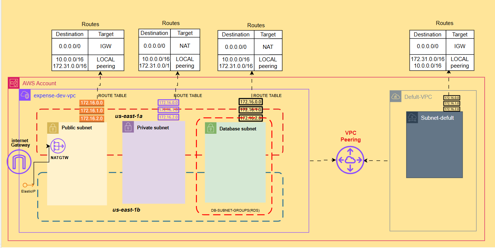

# aws-vpc-module
## Overview
This project sets up an AWS Virtual Private Cloud (VPC) using Terraform. The architecture is designed for high availability and secure networking. It includes:
* VPC
* Internet Gateway associated with VPC
* 2 Public Subnets
* 2 Private Subnets
* 2 Database Subnets
* Database subnet group
* EIP
* NAT Gateway
* Public Route table
* Private Route table
* Database Route table
* Routes
* Route table associations with subnets
* Peering with default VPC(if Required)
* Peering routes in acceptor and requestor route tables
---
# AWS VPC Architecture with Multi-AZ, Subnets, Routing, and Peering

---
## VPC and Subnet Structure
- VPC Name: `expense-dev-vpc`
- Total Subnets: 6
  - 2 Public Subnets (for Frontend)
  - 2 Private Subnets (for Backend)
  - 2 Private Subnets (for Database)
- Availability Zones: Spread across 2 Availability Zones (e.g., `us-east-1a` and `us-east-1b`)
---

## Internet Connectivity
- Public Subnets:
  - Frontend services are deployed here.
  - Connected to the Internet via an Internet Gateway.

- Private Subnets (Backend and Database):
  - Cannot access the Internet directly.
  - Outbound internet access is provided through a NAT Gateway located in one of the public subnets.
  - The NAT Gateway uses an Elastic IP.
  - Route Tables are configured to send private subnet traffic to the NAT Gateway.
---

## VPC Peering
- A VPC Peering connection is created between the custom VPC (`expense-dev-vpc`) and the default VPC.
- Route tables are updated for bidirectional communication between the subnets of both VPCs.
- This allows secure, internal communication between all subnets.
---

## Route Tables and Routes
- Public Route Table:
  - Routes internet-bound traffic (`0.0.0.0/0`) to the Internet Gateway.
  - Contains local routes for VPC-internal communication.
  - Routes to the default VPC subnets through the peering connection.

- Private Route Tables (Backend and Database):
  - Routes internet-bound traffic (`0.0.0.0/0`) to the NAT Gateway.
  - Local route for internal VPC communication.
  - Routes to the default VPC subnets through the peering connection.

- Database Subnets:
  - No internet access.
  - Only local and peering routes for internal, restricted access.
---

## Security and Design Highlights
- Frontend services are hosted in public subnets and accessible from the internet.
- Backend and database services are isolated in private subnets with no direct internet access.
- NAT Gateway allows private subnets to reach the internet securely without exposing them.
- Peering connection enables safe, bidirectional communication with the default VPC.
- All subnets are distributed across two Availability Zones for high availability and redundancy.
---

## Summary
This setup provides a secure and scalable AWS network architecture. It separates public-facing services from internal logic and data layers, ensures controlled traffic flow with route tables and NAT, and allows secure cross-VPC communication using peering.

---
# Inputs
* project_name (Mandatory): User must supply their project name.
* environment (Mandatory): User must supply their environment name.
* vpc_cidr (Mandatory): User must supply their VPC CIDR.
* enable_dns_hostnames (Optional): defaults to true.
* common_tags (Optional): Default is empty. User can supply tags in map(string) format.
* vpc_tags (Optional): Default is empty. User can supply tags in map(string) format.
* igw_tags (Optional): Default is empty. User can supply tags in map(string) format.
* public_subnet_cidrs (Mandatory): User must supply only 2 valid public subnet CIDR.
* public_subnet_tags (Optional): Default is empty. User can supply tags in map(string) format.
* private_subnet_cidrs (Mandatory): User must supply only 2 valid private subnet CIDR.
* private_subnet_tags (Optional): Default is empty. User can supply tags in map(string) format.
* database_subnet_cidrs (Mandatory): User must supply only 2 valid database subnet CIDR.
* database_subnet_tags (Optional): Default is empty. User can supply tags in map(string) format.
* db_subnet_group_tags (Optional): Default is empty. User can supply tags in map(string) format.
* nat_gateway_tags (Optional): Default is empty. User can supply tags in map(string) format.
* public_route_table_tags (Optional): Default is empty. User can supply tags in map(string) format.
* private_route_table_tags (Optional): Default is empty. User can supply tags in map(string) format.
* database_route_table_tags (Optional): Default is empty. User can supply tags in map(string) format.
* is_peering_required (Optional): defaults to false
* vpc_peering_tags (Optional): Default is empty. User can supply tags in map(string) format.

# Output Purpose
* vpc_id – Used to attach additional resources (EC2, ALB, SGs) to this VPC.
* public_subnet_ids – Used to place internet-facing resources like ALBs or EC2 instances.
* private_subnet_ids – Used to deploy backend services that should not be exposed publicly.
* database_subnet_ids – Used for creating RDS instances in isolated subnets.
* database_subnet_group_name – Required when launching an RDS instance within these DB subnets.